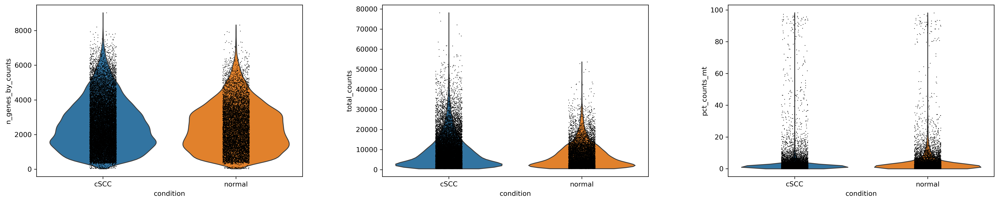
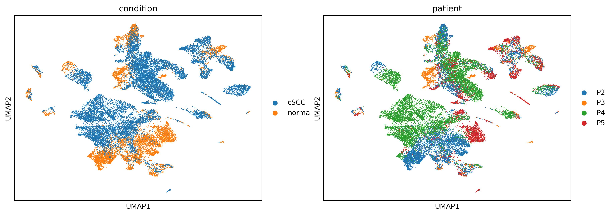
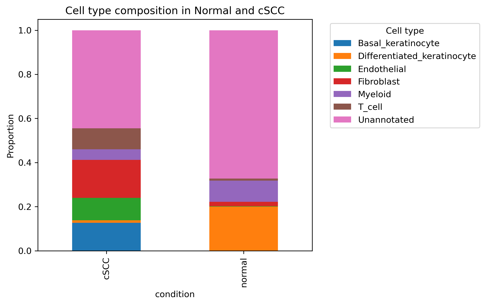

# cSCC Single-Cell RNA-seq Analysis


## Table of Contents

- [Project Overview](#project-overview)
- [Workflow](#workflow)
- [Representative Output](#representative-output)
- [Repository Structure](#repository-structure)
- [Skills Demonstrated](#skills-demonstrated)
- [Reproducibility Notes](#reproducibility-notes)
- [Future Improvements](#future-improvements)

## Project Overview

This repository contains a focused single-cell RNA sequencing (scRNA-seq) portfolio project developed in Python using Scanpy. The project compares patient-derived normal skin-associated samples with cutaneous squamous cell carcinoma (cSCC) samples and demonstrates how single-cell transcriptomic data can be processed, quality-controlled, clustered, and explored for marker gene patterns.

The guiding biological question is:

> How can scRNA-seq analysis be used to compare cellular heterogeneity between normal skin-associated samples and cSCC-associated samples?

Single-cell RNA-seq is appropriate for this question because bulk RNA-seq averages gene expression across mixed cell populations. In contrast, scRNA-seq enables analysis at cell-level resolution, making it possible to explore differences in cell states, clusters, and marker gene expression across normal and disease-associated samples.

The dataset currently referenced in the active notebook includes multiple patient-derived samples labelled as normal or cSCC. Raw data files are not committed to this repository, and the dataset source still needs to be documented fully before the project can be considered reproducible end to end.

## Workflow

The analysis is organized around a standard scRNA-seq workflow:

1. **Quality Control**
   - Calculate cell-level QC metrics.
   - Inspect detected genes per cell, total counts, and mitochondrial gene percentage.
   - Visualize QC distributions to identify low-quality cells and potential outliers.

2. **Filtering**
   - Apply thresholds to remove likely empty droplets, low-quality cells, stressed cells, and potential doublets.
   - Use QC plots to justify filtering decisions.

3. **Normalization**
   - Normalize counts to account for sequencing depth differences between cells.
   - Apply log transformation for downstream analysis and visualization.

4. **Dimensionality Reduction**
   - Use principal component analysis (PCA) to summarize major axes of variation.
   - Use UMAP to visualize cell-level transcriptomic structure in two dimensions.

5. **Clustering**
   - Construct a nearest-neighbor graph.
   - Apply graph-based clustering to identify putative cell populations or cell states.
   - Compare clustering behavior across resolution settings.

6. **Marker Gene Analysis**
   - Identify genes associated with clusters.
   - Use marker gene expression patterns to support biological interpretation.
   - Avoid over-interpreting annotations until marker evidence and dataset metadata are fully documented.

## Representative Output

The active cSCC notebook now runs successfully from top to bottom. The HTML report has been regenerated at `reports/01_QC_Filtering_Normalization.html`, and the following representative figures are available under `results/figures/`.



*QC metrics by condition, showing detected genes per cell, total counts, and mitochondrial read percentage for normal and cSCC-labelled samples.*



*UMAP views coloured by condition and patient/sample metadata to support visual inspection of sample structure after preprocessing.*



*Cell type composition summary for normal and cSCC-labelled samples. Downstream biological interpretation should be treated cautiously because cell type annotations require manual marker review.*

The notebook includes a safe PCA fallback for the Harmony integration step: if Harmony fails or produces an invalid embedding, downstream neighbor graph and UMAP steps can continue from PCA coordinates.

## Repository Structure

```text
single-cell-rna-seq-analysis/
├── LICENSE
├── README.md
├── requirements.txt
├── archive/
│   ├── 02_downstream_analysis_mouse_hematopoiesis.ipynb
│   └── 02_downstream_analysis_mouse_hematopoiesis.html
├── data/
│   └── README.md
├── docs/
│   ├── methodology.md
│   └── future_repo_plan.md
├── notebooks/
│   └── 01_qc_filtering_normalization.ipynb
├── reports/
│   └── 01_QC_Filtering_Normalization.html
└── results/
    ├── figures/
    │   ├── 01_qc_metrics_by_condition.png
    │   ├── 02_umap_condition_patient.png
    │   └── 03_celltype_composition_normal_vs_cscc.png
    └── tables/
```

### `notebooks/`

Contains the Jupyter notebooks for the analysis workflow:

- `01_qc_filtering_normalization.ipynb`: data loading, QC, filtering, normalization, and early dimensionality reduction.

An unrelated exploratory mouse hematopoiesis notebook has been moved to `archive/` pending migration to a separate repository.

### `archive/`

Contains material that is preserved but no longer part of the active cSCC workflow:

- `02_downstream_analysis_mouse_hematopoiesis.ipynb`: exploratory mouse hematopoiesis analysis based on GEO series `GSE107727`.
- `02_downstream_analysis_mouse_hematopoiesis.html`: legacy exported report for the archived mouse hematopoiesis notebook.

### `reports/`

Contains exported report files intended for easier review outside Jupyter:

- `01_QC_Filtering_Normalization.html`: regenerated HTML report for the active cSCC notebook.

### `results/`

Reserved for exported figures and tables generated from the analysis. This keeps final outputs separate from notebooks and makes the repository easier to review.

### `data/`

Documents the data policy for this repository. Raw and processed data files are not committed because single-cell datasets are often large and should be downloaded from their original source when possible.

## Skills Demonstrated

This project demonstrates practical skills relevant to bioinformatics, computational biology, and data science roles:

- **Single-cell RNA-seq analysis** using a standard Scanpy-based workflow.
- **Python programming** for biological data analysis.
- **AnnData/Scanpy workflows** for preprocessing, QC, normalization, clustering, and visualization.
- **Data visualization** using Scanpy, Matplotlib, and Seaborn.
- **Dimensionality reduction** with PCA and UMAP.
- **Graph-based clustering** using nearest-neighbor graphs and Leiden clustering.
- **Differential expression and marker gene analysis** for cluster-level interpretation.
- **Scientific communication** through notebooks, reports, and structured documentation.

## Reproducibility Notes

This repository is being improved for professional portfolio use, but it should not yet be described as fully reproducible.

Current limitations:

- Raw input data files are not included in the repository.
- Dataset accession numbers, source links, and download instructions still need to be documented.
- The active notebook now runs successfully from top to bottom in the project environment.
- The exported HTML report has been regenerated after successful full execution.
- The notebook includes configurable input paths and a Harmony-to-PCA fallback, but downstream biological interpretation should still be treated cautiously because cell type annotations require manual marker review.

To install the current expected Python dependencies:

```bash
pip install -r requirements.txt
```

To open the notebooks locally:

```bash
jupyter notebook
```

Full reproducibility will require documented data access, stable relative paths, a clean environment setup, and successful execution of the notebooks from start to finish.

## Future Improvements

Planned improvements include:

- Document the dataset source, accession identifiers, and download steps.
- Add clearer marker gene evidence for any cell type annotations.
- Add a concise project summary figure for quick GitHub and LinkedIn review.
- Consider adding an `environment.yml` or Dockerfile for stronger reproducibility.
- Extend the analysis with batch correction, cell type annotation, and differential abundance analysis where supported by the dataset.
